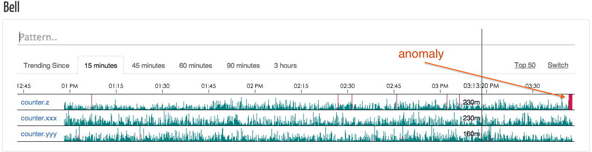

Node-Bell
=========


Latest version: v0.4.3



Node-Bell is a real-time anomalies detection system for periodic time series, built to be
able to monitor a large quantity of metrics. It collects metrics from clients like [statsd](https://github.com/etsy/statsd),
analyzes them with the [3-sigma rule](http://en.wikipedia.org/wiki/68%E2%80%9395%E2%80%9399.7_rule)
and visualizes results on the web. Once enough anomalies were found in a short time, it alerts
you via alerters like hipchat.

Use Case
--------

We ([Eleme](http://ele.me)) use node-bell to monitor our website interfaces, including:

   - interface called frequency
   - interface response time
   - exceptions count
   - ...

Our services and applications send these statistics to [statsd](https://github.com/etsy/statsd),
then statsd sends aggregates to node-bell, node-bell analyzes the current stats
with history data, calculated the trending, and alerts us if the current trending behaves 
anomalous.

Installation
------------

1. Install nodejs (0.11.+), [ssdb](https://github.com/ideawu/ssdb) and [beanstalkd](https://github.com/kr/beanstalkd)
2. Install node-bell via npm

   ```bash
   $ npm install node-bell -g
   ```
3. Add `'node-bell/clients/statsd'` to statsd's backends.
4. Generate default configuration and edit it.

   ```bash
   $ bell -s
   ```
5. start ssdb, beanstalkd, statsd.
6. start bell's services.

   ```
   $ bell <service-name> -c <path-to-config-file>
   ```

Services
---------
