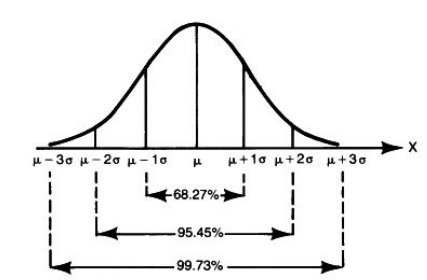

Design Notes
============

Anomalies detection algorithm
------------------------------

A simple approach to detect anomalies(or outliers) is to set max/min
thresholds, but the problem is how large/small they should be, and it
is hard to set good thresholds one by one for a lot of metrics.

Bell takes the `3-sigma` rule (one case of [68–95–99.7 rule](http://en.wikipedia.org/wiki/68%E2%80%9395%E2%80%9399.7_rule),
and maybe related to [z-score](http://en.wikipedia.org/wiki/Standard_score)):

**States that nearly all values (99.7%) lie within 3 standard deviations
of the mean in a normal distribution.**



Describe it in pseudocode:

```js
function isAnomaly(val) {
    return abs(val - mean) > 3 * std;
}
```

The 3-sigma rule gives us dynamic thresholds which rely on history data.

Now let's take a factor, say it `m`, used to describe the anomalous serverity, it's
defined as the ratio of `abs(val - mean)` to `3 * std`:

```
m = abs(val - mean) / (3 * std);
```

If a value gives `m > 1`, it must be anomalous, and the `m` larger, the more
serious anomalous.

Apparently, `m` is the target result for bell's analyzer.

Eliminate periodicity
---------------------


Reality metrics are always with periodicity, the marked point on the picture above
should be an anomaly (it should be much smaller at this time),
so bell only picks datapoints with same "phase" to feed the
analyzer.

Anomalous Serverity Trending
----------------------------

It's important to find out the metrics with anomalous serverity trending up, bell takes
a method via [weighted moving average](http://en.wikipedia.org/wiki/Moving_average) to describe
the current trending for `m`:

```
t[0] = m[0]
t[i + 1] = t[i] * (1 - factor) + factor * m[i]
```

In the recursive formula above, `t` is the trending sequence, `m` is the anomalous
serverity sequence, factor is a real number between 0 and 1.

If you expand the this formula, you will find that it dilutes old data's contribution,
later data contributes more to the result, and the `factor` larger, the timeliness better.
In a word, the result `t` follows the trending of sequence `m`.

Data flow and storage schema
-----------------------------

* The data flow between bell services and external database or clients
  is described below:

   ```
   [clients]->[listener]->[beanstalkd]
                             |
                             v
              --------> [analyzers] ------> [alerter]
              |              |
      history |         save v    visualize
              ------------ [ssdb] --------> [webapp]
   ```

* The datapont storage schema (using sorted set):

   ```
   key       |  score
   ------------------------------------------------
   timestamp | value:anomalous severity:timestamp
   ```

Listener Net Protocol
---------------------

The net protocol between clients and bell listener is very simple:

```
Packet := Block+
Block  := Size '\n' Data
Size   := literal_integer
Data   := literal_stringify_json
```

example:

```
57
[['foo', [1412762335, 3.14]], ['bar', [1412762335, 314]]
58
[['foo', [1412762345, 3.15]], ['bar', [1412762345, 2348]]
```
